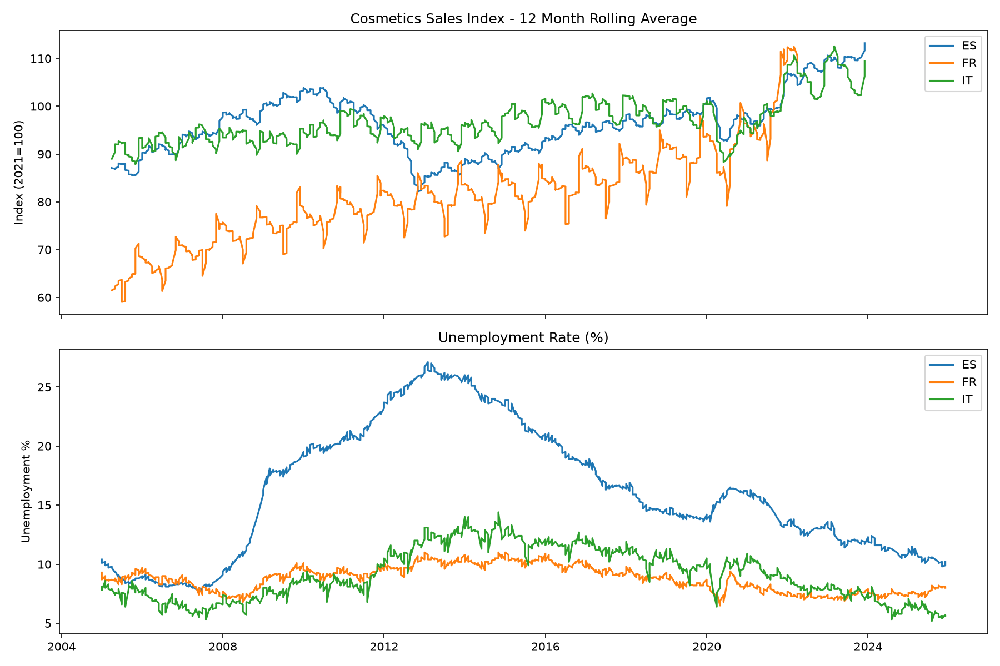

# The Lipstick Effect in Europe

## What is the Lipstick Effect?
The lipstick effect consists on an economic theory linking cosmetic retail to unemployment. 
It suggests that these small affordable luxuries are not affected by economic downturns. 
While bigger pruchases are cut, sales of these goods remain constant.

## What is the project about?
Here we analyse cosmetic retail for three countries, including Spain, France and Italy. 
Data from 2005 to 2023 is analysed and compared against unemployment in order to test 
whether if the Lipstick Effect is visible or not. 

## Key Findings
- There was a weak correlation across all three countries (ES: -0.31, FR: -0.05, IT: 0.10)
- Even during the financial crisis in Spain in 2008 (reaching 27% of unemployment) cosmetic sales remained stable
- During 2020 (COVID) we do appreciate a small dip followed by a really quick recovery 
- In general we see a long term rising trend despite economic crises

## Chart

##Data Sources 
- Cosmetics retail sales: Eurostat (dataset: sts_trtu_m, category G47_NF_HLTH) 
- Unemployment rates: Eurostat (dataset: une_rt_m)

## Tools Used
- Python, Pandas, Matplotlib
- Jupyter Notebook

## Files
- 'Analysis.ipynb' - Jupyter notebook 
- 'data/' - Raw data from Eurostat
- 'images/' - Charts 
